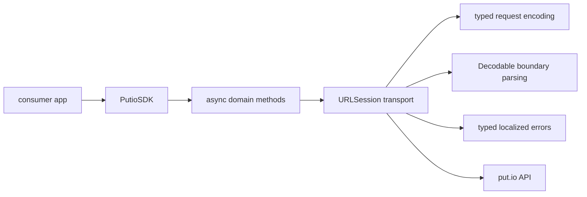

# SDK Overview

## Goal

Explain the actual `putio-sdk-swift` package shape for humans and agents.

## System View

## Components

| Component | Responsibility |
| --- | --- |
| `PutioSDK` | shared SDK entrypoint and transport composition |
| Async methods | preferred modern API surface using `async throws` |
| Boundary models | typed request inputs plus `Encodable` request values and `Decodable` response types for the modernized domains |
| Error model | typed transport, API, and decoding failures with `LocalizedError` guidance plus retry and classification helpers |

## Design Rules

- prefer native Swift concurrency over callback-first transport code
- parse external data at the boundary with `Decodable`
- encode request query and body values through SDK-owned typed primitives instead of untyped parameter bags
- keep the CocoaPods and Swift Package surfaces aligned
- preserve forward compatibility where possible instead of crashing on unknown backend strings
- keep live-tested domains on the modern async path first, then expand outward
- keep the public API single-surface and async-first instead of splitting effort across compatibility wrappers

## Swift Concurrency Posture

The Swift Package and CocoaPods SDK targets enable Swift's
`NonisolatedNonsendingByDefault` upcoming feature. Their async instance methods
therefore run on the caller's actor instead of sending the mutable client and
response models to a generic executor. This is the Swift 6.2 behavior defined by
[SE-0461](https://github.com/swiftlang/swift-evolution/blob/main/proposals/0461-async-function-isolation.md).

Consumer ownership rules:

- keep each `PutioSDK` instance on one actor, such as the app's `@MainActor`
  model or a dedicated session actor
- create and mutate `config`, `delegate`, and legacy mutable response models on
  that same actor; do not capture them in detached or concurrent tasks
- pass the SDK's explicitly `Sendable` value inputs and immutable value results
  between actors when needed
- prefer calling an actor-owned SDK through actor methods instead of declaring
  the client `@unchecked Sendable`

The public query, update, error, and immutable transfer value types that contain
only `Sendable` state declare that conformance explicitly. The older `open`
class models remain mutable and non-`Sendable`; converting them to immutable
value types would be an API-breaking model migration, so actor ownership is the
supported posture for them today. The mutable `PutioClearDataOptionKeys` global
is also legacy API outside the audited strict-concurrency surface; replacing it
with an immutable scoped API requires a deliberate major release.

`PutioSDKStrictConcurrencyTests` is a Swift 6 consumer target. It compile-checks
all SDK domains from `@MainActor`, proves an actor-owned client, and requires the
low-risk value surface to conform to `Sendable`. Swift's migration guide notes
that public `Sendable` conformances are API contracts and that manual unsafe
conformance should not be used for types that are not actually thread-safe:
[Swift 6 concurrency migration guide](https://www.swift.org/migration/documentation/swift-6-concurrency-migration-guide/commonproblems/).

## Current Modernized Slice

- `account`
  - `getAccountInfo`
  - `getAccountSettings`
  - `saveAccountSettings`
  - `clearAccountData`
  - `destroyAccount`
- `auth`
  - `getAuthCode`
  - `checkAuthCodeMatch`
  - `logout`
  - `validateToken`
  - `generateTOTP`
  - `verifyTOTP`
  - `getRecoveryCodes`
  - `regenerateRecoveryCodes`
- `grants`
  - `getGrants`
  - `revokeGrant`
  - `linkDevice`
- `history`
  - `getHistoryEvents` with typed `per_page` / `before` query input and `has_more` response state
  - `clearHistoryEvents`
  - `deleteHistoryEvent`
- `files`
  - `getFiles`
  - `getFile`
  - `searchFiles`
  - `continueFileSearch`
  - `createFolder`
  - `deleteFiles`
  - `copyFiles`
  - `moveFiles`
  - `renameFile`
  - `findNextFile`
  - `setFileSort`
  - `resetFileSort`
  - `getStartFrom`
  - `setStartFrom`
  - `resetStartFrom`
  - `getMp4ConversionStatus`
  - `startMp4Conversion`
- `routes`
  - `getRoutes`
- `subtitles`
  - `getSubtitles` with the backend default key and subtitle `format` preserved
- `transfers`
  - `listTransfers`
  - `continueTransfers`
  - `getTransfer`
  - `countTransfers`
  - `getTransferInfo`
  - `addTransfer`
  - `addTransfers`
  - `cancelTransfers`
  - `cleanTransfers`
  - `retryTransfer`
- `trash`
  - `listTrash`
  - `continueListTrash`
  - `restoreTrashFiles`
  - `deleteTrashFiles`
  - `emptyTrash`

## Native Baseline Coverage

| Baseline family | Swift coverage |
| --- | --- |
| Auth and OAuth | `covered` |
| Account basics and settings | `covered` |
| Security and 2FA | `covered` |
| Files browse and detail | `covered` |
| Search with cursor continuation | `covered` |
| Transfers | `covered` |
| History and events | `covered` |
| Trash with cursor continuation | `covered` |
| Subtitles | `covered` |
| Playback-adjacent helpers | `covered` |

Typed query inputs exist for account info, account settings updates, file listing, file detail projections, file search and continuation, transfer listing, and trash listing. Cursor or continuation flows stay explicit where the backend exposes them.

## What This Package Is Not

- not a generic JSON bag around the put.io API
- not dependent on Alamofire for request construction or transport
- not full namespace parity with the TypeScript SDK yet
- not a dual-surface SDK with callback compatibility as a first-class goal
